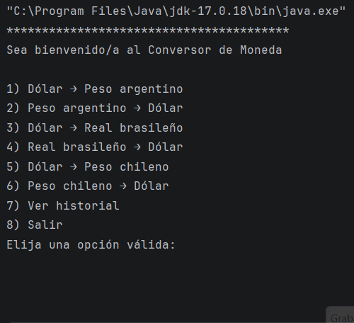

# 💱 Conversor de Monedas en Java

Aplicación de consola desarrollada en Java que permite convertir monedas utilizando tasas de cambio en tiempo real obtenidas desde una API.

Este proyecto fue desarrollado como parte del programa de formación Java de Alura Latam y Oracle Next Education.

---

## 🚀 Funcionalidades

- Conversión de diferentes monedas
- Consumo de API para obtener tasas de cambio actualizadas
- Menú interactivo en consola
- Entrada de datos por parte del usuario

---

## 🛠️ Tecnologías utilizadas

- Java 17
- ExchangeRate API
- Gson
- IntelliJ IDEA
- Git y GitHub

---

## ⚙️ Configuración

Este proyecto utiliza la API de [ExchangeRate-API](https://www.exchangerate-api.com/) para obtener tasas de cambio en tiempo real.

### Obtener una clave de API gratuita:

1. Ve a [https://www.exchangerate-api.com/](https://www.exchangerate-api.com/)
2. Regístrate gratis (solo email)
3. Confirma tu email
4. Copia tu clave de API (API Key)

### Configurar la clave en el proyecto:

**Opción 1 (Recomendada - Usando variable de entorno):**
1. En la carpeta del proyecto, renombra el archivo `.env.example` a `.env`
2. Abre `.env` y reemplaza `TU_API_KEY_AQUI` con tu clave real
3. ¡Listo! El programa usará automáticamente tu clave

**Opción 2 (Solo para pruebas rápidas):**
Si tienes problemas con variables de entorno, puedes modificar `ConsultaAPI.java`:
```java
// CAMBIA esta línea:
String API_KEY = System.getenv("EXCHANGE_API_KEY");

// POR esta (con TU clave real):
String API_KEY = "tu-clave-real-aqui";
```
⚠️ **Importante**: Si usas la Opción 2, NUNCA subas el archivo modificado a GitHub.

## 📌 Ejemplo de uso

*****************************************
Sea bienvenido/a al Conversor de Moneda
*****************************************

1) Dólar => Peso Argentino
2) Peso Argentino => Dólar
3) Dólar => Real Brasileño
4) Real Brasileño => Dólar
5) Dólar → Peso chileno
6) Peso chileno → Dólar
7) Ver historial
8) Salir

---

## ▶️ Cómo ejecutar el proyecto

1. Clonar el repositorio
2. Abrir el proyecto en IntelliJ IDEA
3. **Descargar Gson** (si no lo tienes):
   - Ve a [Maven Repository: Gson](https://mvnrepository.com/artifact/com.google.code.gson/gson)
   - Descarga la versión 2.13.2 (o superior) del archivo `.jar`
4. **Agregar Gson al proyecto**:
   - En IntelliJ, ve a **File → Project Structure → Libraries**
   - Haz clic en **+** → **Java**
   - Selecciona el archivo `gson-2.13.2.jar` que descargaste
   - Haz clic en **OK**
5. Ejecutar la clase `ConversorApp`
6. ¡Usar el conversor!
   
---

## 📚 Autor

Proyecto desarrollado por **José Luis Fernández** durante su aprendizaje de Java en Alura Latam.
